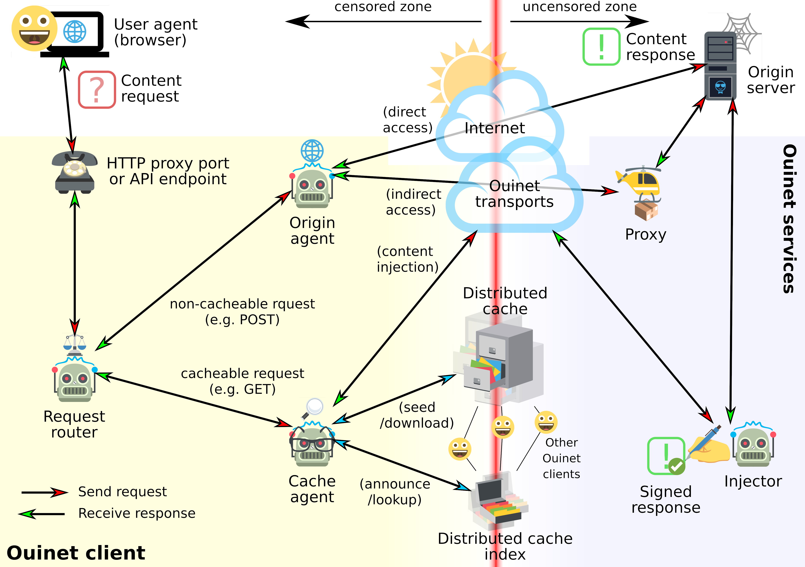

# Overview

See [lightning talk at the Decentralized Web Summit 2018](http://archive.org/details/dweb-8_2_18_Lightning_Talks_New_Discoveries_5?start=547).

**Ouinet** is a Free/Open Source technology which allows web content to be
served with the help of an entire network of cooperating nodes using
peer-to-peer routing and distributed caching of responses.  This helps
mitigate the Web's characteristic single point of failure due to a client
application not being able to connect to a particular server.

The typical Ouinet *client* node setup consists of a web browser or other
application using a special HTTP proxy or API provided by a dedicated program
or library on the local machine.  When the client gets a request for content,
it attempts to retrieve the resource using several mechanisms.  It tries to
fetch the page from a *distributed cache* by looking up the content in a
*distributed cache index* (like the [BitTorrent][] DHT), and if not available,
it contacts a trusted *injector* server over a peer-to-peer routing system
(like [I2P][]) and asks it to fetch the page and store it in the distributed
cache.

[BitTorrent]: https://www.bittorrent.org/
[I2P]: https://geti2p.net/ "Invisible Internet Project"

Future access by client nodes to popular content inserted in distributed
storage shall benefit from increased redundancy and locality, which
translates to: increased availability in the face of connectivity problems;
increased transfer speeds in case of poor upstream links; and reduced
bandwidth costs when internet access providers charge more for external or
international traffic.  Content injection is also designed to
allow for content re-introduction and seeding in extreme cases of total
connectivity loss (e.g. natural disasters).

The Ouinet library is a core technology that can be used by any application to
benefit from these advantages.  Ouinet integration provides any content
creator the opportunity to use cooperative networking and storage for the
delivery of their content to users around the world.

**Warning:** Ouinet is still **highly experimental**.  Some features (like
peer-to-peer routing) may or may not not work smoothly depending on the
different back-end technologies, and random unexpected crashes may occur.
Also, Ouinet is **not an anonymity tool**: information about your browsing
might be leaked to other participants in the network, as well as the fact that
your application is seeding particular content.  Running some components (like
injector code) may turn your computer into an open web proxy, and other
security or privacy-affecting issues might exist.  Please keep this in mind
when using this software and only assume reasonable risks.
